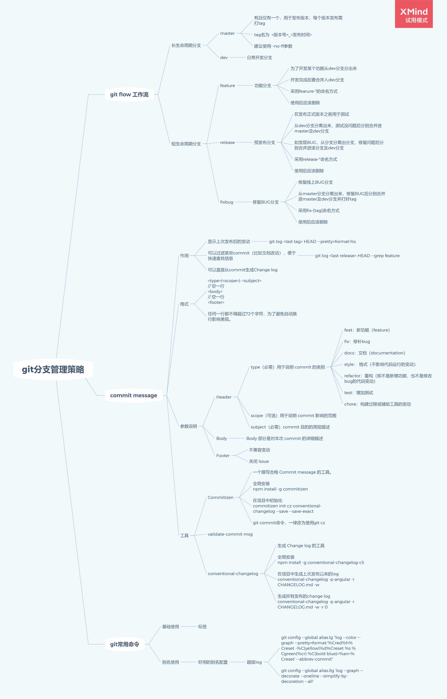

# git分支管理策略



## git flow工作流


为了解决杂乱的工作流，而产生的分支管理策略


### 分支

**长生命周期分支**
1. 主分支Master


> 有且仅有一个，用于发布版本，每个版本发布需打tag <br/>
> tag名为  <版本号>_<发布时间> <br/>
> 建议使用--no-ff参数 <br/>

[参数说明](#--no-ff参数说明)


2. 开发分支Develop

> 日常开发分支


**短生命周期分支**
1. 功能分支

> 为了开发某个功能从dev分支分出来 <br/>
> 开发完成后要合并入dev分支 <br/>
> 采用fearure-*的命名方式 <br/>
> 使用后应该删除 <br/>


2. 预发布分支

> 在发布正式版本之前用于测试 <br/>
> 从dev分支分离出来，测试没问题后分别合并进master及dev分支 <br/>
> 如发现BUG，从分支分离出分支，修复问题后分别合并进该分支及dev分支 <br/>
> 采用release-*命名方式 <br/>
> 使用后应该删除 <br/>

3. 修复BUG分支

> 修复线上BUG分支 <br/>
> 从master分支分离出来，修复BUG后分别合并进master及dev分支并打好tag <br/>
> 采用fix-[tag]命名方式 <br/>
> 使用后应该删除 <br/>


### commit message

``` js
git commit -m 'feat(index): 完成sayhello需求开发'
```

**作用**

1. 显示上次发布后的变动

```
git log <last tag> HEAD --pretty=format:%s
```

2. 可以过滤某些commit（比如文档改动），便于快速查找信息
	
```
git log <last release> HEAD --grep feature
```

3. 可以直接从commit生成Change log

**格式**

``` js
<type>(<scope>): <subject>
```

> 任何一行都不得超过72个字符，为了避免自动换行影响美观。

**参数说明**

1. Header
- type（必需）用于说明 commit 的类别
	feat：新功能（feature）
	fix：修补bug
	docs：文档（documentation）
	style： 格式（不影响代码运行的变动）
	refactor：重构（即不是新增功能，也不是修改bug的代码变动）
	test：增加测试
	chore：构建过程或辅助工具的变动
- scope（可选）用于说明 commit 影响的范围
- subject（必需）commit 目的的简短描述

**工具**

1. Commitizen

> 一个撰写合格 Commit message 的工具。

- 全局安装
```
npm install -g commitizen
```

- 在项目中初始化
```
commitizen init cz-conventional-changelog --save --save-exact
```

> git commit命令，一律改为使用git cz

2. validate-commit-msg

> 校验commit是否符合规范

[配置方法](https://www.npmjs.com/package/validate-commit-msg)

3. conventional-changelog

> 生成 Change log 的工具

- 全局安装

``` js
npm install -g conventional-changelog-cli
```

- 在项目中生成上次发布以来的log
``` js
conventional-changelog -p angular -i CHANGELOG.md -w
```

- 生成所有发布的change log
``` js
conventional-changelog -p angular -i CHANGELOG.md -w -r 0
```

### git常用命令

#### 标签

**列出所有tag**

```
git tag
```

**新建一个tag在当前commit**

```
git tag [tag]
```

**新建一个tag在指定commit**
```
git tag [tag] [commit]
```

**删除本地tag**
```
git tag -d [tag]
```

**删除远程tag**
```
git push origin :refs/tags/[tagName]
```

**查看tag信息**

```
git show [tag]
```

**提交指定tag**

```
git push [remote] [tag]
```

**提交所有tag**

```
git push [remote] --tags
```

**新建一个分支，指向某个tag**

```
git checkout -b [branch] [tag]
```


### 应用场景

**开发新功能**
1. 自dev分支新建分支feature-sayhello分支
```
git checkout -b feature-sayhello
```
2. 开发完成后合并到dev分支
```
git merge --no--ff feature-sayhello
```
3. 自dev分支创建release-v1.0分支，提交测试
```
git checkout -b release-v1.0
```
4. 测试通过后分别合并至dev分支及master分支
```
git checkout dev
git merge --no--ff release-v1.0
git checkout master
git merge --no--ff release-v1.0
```
5. 在master分支打上tag
```
git tag v1.0_21.2.3
git push origin --tags
```

**修复线上问题**
1. 新建fixbug分支，指向出问题的tag
``` js
git checkout -b fixbug-v1.0 v1.0_21.2.2    
```
2. 修复问题并测试通过后分别合并至dev及master分支
```
git checkout dev
git merge --no--ff fixbug-v1.0
git checkout master
git merge --no--ff fixbug-v1.0
```


#### --no-ff参数说明

1. 未使用--no-ff参数


2. 使用--no-ff参数


[返回长生命周期分支](#长生命周期分支)


# 延申阅读
- 三大分支管理策略


[Git操作指南: 企业级项目分支管理流程 - SourceTree Mac 版](https://www.mdeditor.tw/pl/p7L4)

[git flow分支管理策略](https://developer.ibm.com/zh/articles/os-cn-git-and-github-5/)
[Git flow实践](https://cloud.tencent.com/developer/article/1592957)

[常用git命令清单](http://www.ruanyifeng.com/blog/2015/12/git-cheat-sheet.html)
[自动化版本控制](https://mp.weixin.qq.com/s/N3XDI8wSSgi9IX-cSbaCuw)

[commit规范](http://www.ruanyifeng.com/blog/2016/01/commit_message_change_log.html)
[阮一峰](https://www.ruanyifeng.com/blog/2012/07/git.html)
[分支管理项目简单实践](https://www.cnblogs.com/spec-dog/p/11043371.html)
[Git 工作流程](http://www.ruanyifeng.com/blog/2015/12/git-workflow.html)
[Git分支管理实践-撤销](https://zhuanlan.zhihu.com/p/72946397)
<!-- [设置保护](https://help.coding.net/docs/host/branch.html) -->
<!-- [化简为繁](https://my.oschina.net/u/4026710/blog/4381609) -->
<!-- [新建与合并](https://git-scm.com/book/zh/v2/Git-%E5%88%86%E6%94%AF-%E5%88%86%E6%94%AF%E7%9A%84%E6%96%B0%E5%BB%BA%E4%B8%8E%E5%90%88%E5%B9%B6) -->


